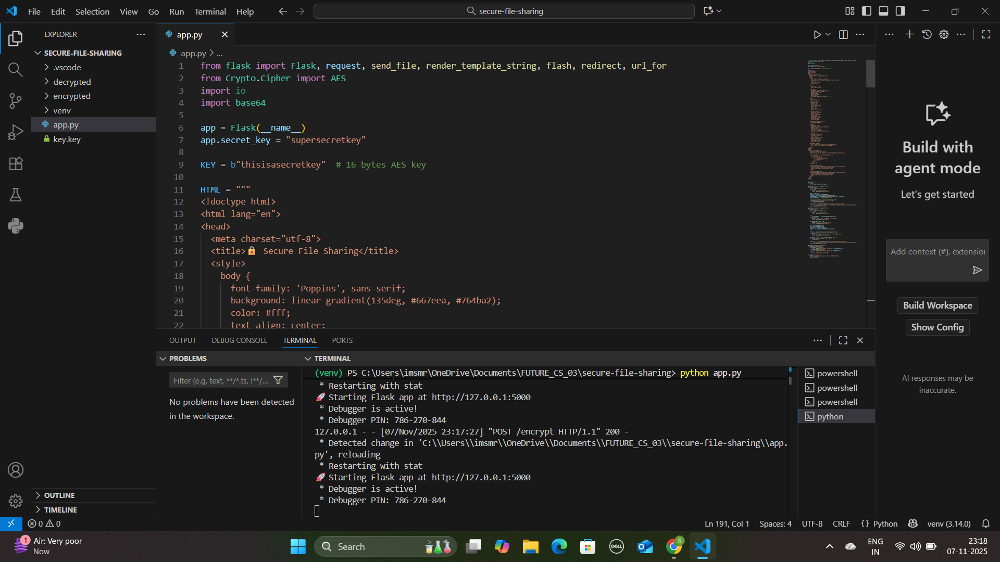
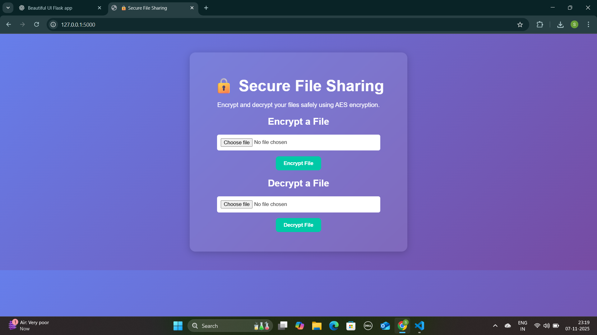

# FUTURE_CS_03 🔐 Secure File Sharing System

## 📌 Overview

This project was developed as part of the **Future Interns Cyber Security Internship (Task 3)**. It provides a secure platform for uploading, downloading, and managing files using **AES-256 encryption**, ensuring data confidentiality and integrity.

---

## 🔍 About the Task

In this hands-on internship project, I built a secure file sharing system that allows users to upload and download files safely. The core focus was **data protection**, where I implemented AES-256 encryption to safeguard files during both storage and transfer.

This project simulates real-world scenarios where secure data sharing is essential—such as in healthcare, legal, or corporate environments.

---

## ✅ What I Did

- Developed a Flask-based web portal for file uploads and downloads  
- Implemented AES-256 encryption using PyCryptodome  
- Built a simple HTML/CSS user interface for uploading, downloading, and deleting files  
- Added error handling for invalid decryption attempts  
- Documented the system architecture and security measures  
- Uploaded screenshots and final report to GitHub  

---

## 🎯 Skills I Gained

- Web Development with Flask  
- Cryptographic Algorithms (AES encryption & decryption)  
- Secure File Handling & Data Protection  
- Basic Cryptography Concepts (key generation, storage, and management)  
- Version Control with Git & GitHub  
- Working in Kali Linux for cybersecurity projects  

---

## 🛠️ Tools & Technologies

- Python 3.10  
- Flask – Backend framework  
- PyCryptodome – Cryptography library  
- HTML / CSS – Frontend UI  
- Git & GitHub – Version control  
- Kali Linux – Development & testing environment  

---

## 📸 Screenshots

### 🔐 Server Start

### 🏠 Homepage

### ✅ Upload Success

### 📥 File Download

###  Decryption 

### 🗑️ Decryption_success

---

## 📄 Report

You can view the full project report 
[HERE](<SECURE FILE SHARING SYSTEM REPORT  FILE.pdf>)

---

## 📝 Author

**Smridhi Gera**  
CIN ID: FIT/SEP25/CS4021
Future Interns Cyber Security Program  
